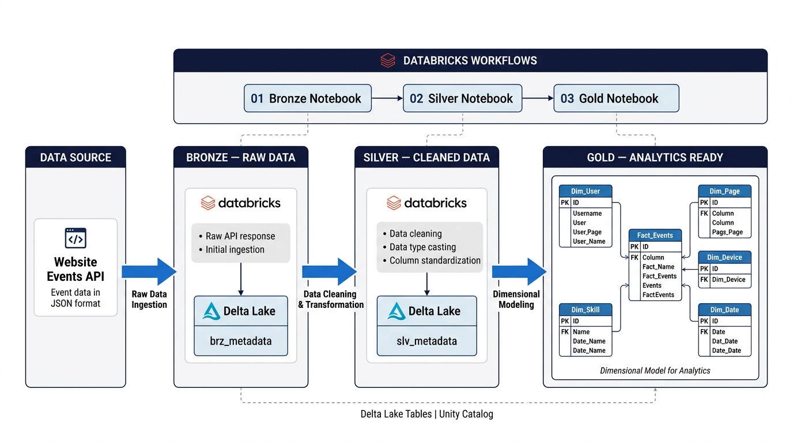
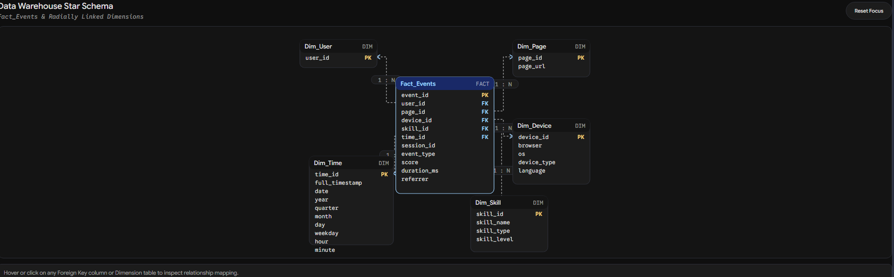
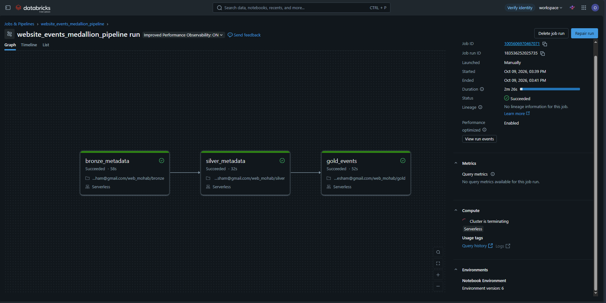

# Website Events Analytics Pipeline | Databricks

An end-to-end data engineering project that transforms website event data from an API into analytics-ready datasets using the Medallion Architecture and dimensional modeling.

## Project Overview

This project implements a data pipeline in **Azure Databricks** that ingests website event data from an API, processes it through Bronze, Silver, and Gold layers, and organizes the final data into a dimensional model for analytical use.

The pipeline is orchestrated using **Databricks Workflows**, with three notebooks executed sequentially.

## Architecture



The pipeline follows the Medallion Architecture:

* **Bronze Layer:** Ingests the raw API data into a Delta Lake table.
* **Silver Layer:** Cleans the data, converts data types, and standardizes columns.
* **Gold Layer:** Builds a fact table and dimension tables using a Star Schema.

## Data Model

The Gold layer contains the following tables:

**Fact Table**

* `Fact_Events`

**Dimension Tables**

* `Dim_User`
* `Dim_Page`
* `Dim_Device`
* `Dim_Skill`
* `Dim_Date`

The fact table connects to the dimension tables through foreign keys to support analytical queries.



## Pipeline Orchestration

The pipeline is orchestrated using **Databricks Workflows** with the following execution order:

1. `01_bronze.ipynb`
2. `02_silver.ipynb`
3. `03_gold.ipynb`

Each notebook runs after the previous task completes successfully.



## Tech Stack

* **Language:** Python, SQL
* **Processing:** Apache Spark, PySpark
* **Platform:** Databricks
* **Storage Format:** Delta Lake
* **Architecture:** Medallion Architecture
* **Data Modeling:** Star Schema
* **Orchestration:** Databricks Workflows
* **Governance:** Unity Catalog

## Repository Structure

```text
website-events-medallion/
├── notebooks/
│   ├── bronze.ipynb
│   ├── silver.ipynb
│   └── gold.ipynb
├── images/
│   ├── architecture.png
│   ├── star_schema.png
│   └── pipeline_run.png
├── README.md
└── .gitignore
```

## Key Engineering Concepts

* API data ingestion
* Layered data processing with the Medallion Architecture
* Data cleaning and type standardization
* Delta Lake table management
* Fact and dimension table design
* Workflow orchestration and task dependencies

## Future Improvements

* Implement automated data quality checks.
* Add incremental processing if the source data volume and update patterns justify it.
* Introduce automated scheduling when the source update frequency requires it.

---

*This project was built as a hands-on demonstration of data engineering concepts using Databricks and Apache Spark.*
